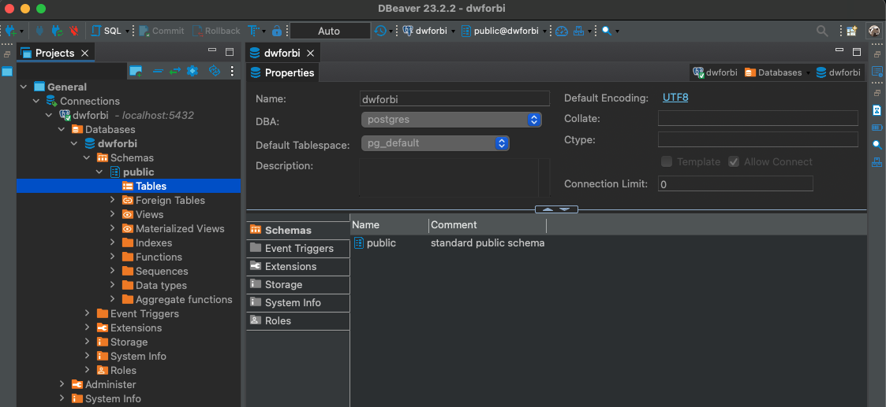

# [University of Colorado - Data Warehousing for Business Intelligence Specialization](https://www.coursera.org/specializations/data-warehousing)
### Harness Business Data . Build a fully-optimized business data warehouse in five courses.

## REQUIREMENTS

- Docker
- Docker Compose
- DBMS Client (DBeaver) 

## SETUP

```
docker-compose up -d
```

## ENVIRONMENTS AND DATABSE CONNECTION

```
PG_CONTAINER_NAME='postgres_container_name'
POSTGRES_USER='postgres'
POSTGRES_PASSWORD='postgres'
POSTGRES_DB='postgres_db_name'
PGDATA='/data/postgres-db-name'
```


