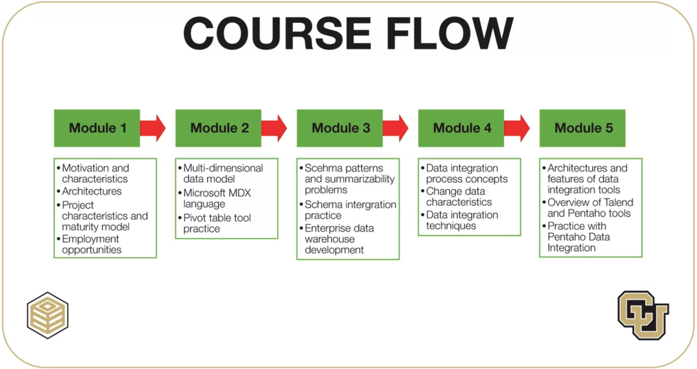

### Data Warehouse Concepts, Design, and Data Integration

The second course in a Data Warehousing for Business Intelligence specialization covers
essential topics such as data warehouse design, multidimensional data manipulation, and
data integration, preparing students for careers in data warehousing and business 
intelligence. The target audience includes university students and professionals,
requiring prior knowledge of relational databases and SQL. The course culminates in a
final project, integrating the knowledge acquired throughout the specialization.

