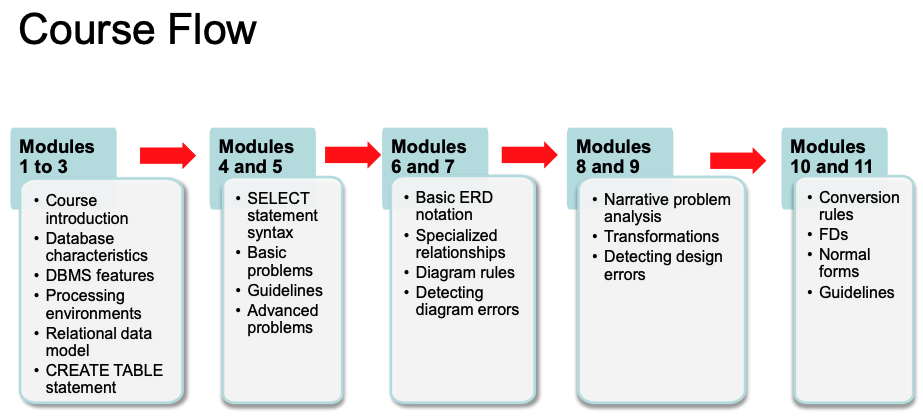

### Database Management Essentials

Database Management Essentials is a foundational course for the Data Warehousing and Business
Intelligence specialization, taught by Professor Michael Mannino. The course aims to provide
students with essential skills for a career in database development, data warehousing, or
business intelligence.

